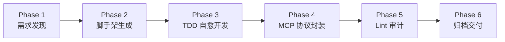

# AutoForge

<div align="center">


**一个全自动的"项目工厂" — 从需求发现到 MCP 工具交付，全程零干预**

[](https://www.python.org/downloads/)
[](LICENSE)
[](https://docs.astral.sh/ruff/)

[功能特性](#-功能特性) • [快速开始](#-快速开始) • [架构设计](#-架构设计) • [配置说明](#-配置说明) • [贡献指南](#-贡献指南)

</div>

---

## 📖 项目简介

AutoForge 是一个**全自动的项目工厂**。它根据 `RULES.md` 独立发现需求、编写代码、进行 TDD 闭环自测，并最终交付支持 MCP 协议的本地工具。

**核心理念**: 从 `mkdir` 到交付，全程零人工干预。



---

## ✨ 功能特性

| 特性 | 说明 |
|------|------|
| 🧠 **智能需求发现** | 通过 GitHub API 搜索痛点，数据驱动立项决策 |
| 🔄 **TDD 自愈循环** | 测试失败 → LLM 根因分析 → 自动修复 → 重测，直到通过 |
| 📦 **MCP 原生交付** | 自动生成 MCP Server 封装，OpenClaw 点击即用 |
| 🔒 **环境隔离** | 每个子项目独立 venv，不污染主环境 |
| 🛡️ **零授权原则** | 生成的项目无需 API Key、登录或付费 |
| ✅ **静态合规** | 交付前强制 Ruff Lint 检查 |

---

## 🚀 快速开始

### 环境要求

- Python 3.12+
- 支持 OpenAI Chat Completions 格式的 LLM API（如小米 MIMO）

### 安装

```bash
# 克隆仓库
git clone https://github.com/wp-i/autoForge.git
cd autoForge

# 安装依赖
pip install -r requirements.txt
```

### 配置

创建 `.env` 文件：

```bash
# LLM 配置（必需）
AUToforge_LLM_API_KEY=your_api_key_here
AUToforge_LLM_BASE_URL=https://api.xiaomimimo.com
AUToforge_MODEL_NAME=MiMo-V2-Pro

# GitHub Token（可选，用于查重）
GITHUB_TOKEN=your_github_token_here
```

### 运行

```bash
python main.py
```

**就这么简单！** AutoForge 会自动完成从立项到交付的全流程。

---

## 🏗️ 架构设计

```
autoForge/
├── main.py                 # 状态机调度器
├── config.yaml             # 运行配置
├── RULES.md                # 工程约束规则
├── engine/
│   ├── strategist.py       # Phase 1: 需求发现
│   ├── architect.py        # Phase 2: 脚手架生成
│   ├── coder.py            # Phase 3: TDD 自愈开发 ⭐核心
│   ├── mcp_wrapper.py      # Phase 4: MCP 协议封装
│   ├── auditor.py          # Phase 5: Lint 审计
│   ├── llm_client.py       # LLM 调用层
│   └── logger.py           # 双路日志系统
├── output/                 # 子项目构建目录
└── delivered/              # 最终交付归档
```

### 核心流程

#### Phase 1: Strategist（立项官）
- 通过 GitHub API 搜索痛点
- 验证 `[ZERO_AUTH]` `[NO_REPO_CLONE]` 规则
- 输出 `spec.json`

#### Phase 2: Architect（架构师）
- 创建隔离目录和 venv
- 生成 `requirements.txt`（锁定最新版本）
- 初始化基础文件结构

#### Phase 3: Coder（代码与自愈单元）⭐
```
测试 → 失败 → 分析 → 修复 → 重测
         ↓
   连续 N 次 PATCH 无效
         ↓
   强制 RETHINK（换算法/库）
         ↓
   达到 MAX_RETRIES → 放弃
```

#### Phase 4: MCP Wrapper（协议封装）
- 解析 `src/core.py` 函数签名
- 自动生成 MCP Tools 注册代码

#### Phase 5: Auditor（审计员）
- 执行 Ruff Lint 检查
- 自动修复可修复的问题

#### Phase 6: Done（归档）
- 移动到 `delivered/` 目录
- 生成 `delivery_summary.json`

---

## ⚙️ 配置说明

`config.yaml` 主要参数：

```yaml
# 自愈循环控制
max_retries: 5                 # 单轮最大重试次数
force_rethink_after: 3         # 连续 N 次修补无效后强制换算法

# LLM 参数
llm:
  temperature: 0.3             # 代码生成偏保守
  max_tokens: 8192

# 子项目偏好
project:
  preferred_language: "python"
  min_complexity_score: 3      # 复杂度下限（拒绝简单 Demo）
```

---

## 📋 RULES.md 工程约束

| 规则 | 说明 |
|------|------|
| `[SELF_HEAL_TDD]` | 测试驱动，失败后自动分析修复 |
| `[ENV_ISOLATION]` | 子项目独立 venv |
| `[MCP_NATIVE]` | 最终交付必须包含 MCP 封装 |
| `[ZERO_AUTH]` | 禁止生成需登录/API Key 的项目 |
| `[DATA_DRIVEN]` | 立项依据必须来自客观数据 |
| `[NO_REPO_CLONE]` | GitHub 查重，避免重复造轮子 |
| `[LINT_CLEAN]` | 交付前必须通过静态检查 |
| `[ZERO_INTERVENT]` | 全程零人工干预 |

---

## 📊 项目状态

```
✅ Phase 1 - Strategist   需求发现
✅ Phase 2 - Architect    脚手架生成
✅ Phase 3 - Coder        TDD 自愈开发
✅ Phase 4 - MCPWrapper   MCP 协议封装
✅ Phase 5 - Auditor      Lint 审计
✅ Phase 6 - Done         归档交付
```

---

## 🤝 贡献指南

欢迎贡献！请遵循以下步骤：

1. Fork 本仓库
2. 创建特性分支：`git checkout -b feature/amazing-feature`
3. 提交更改：`git commit -m 'Add amazing feature'`
4. 推送分支：`git push origin feature/amazing-feature`
5. 提交 Pull Request

### 开发规范

- 代码风格：使用 Ruff 格式化
- 提交信息：遵循 [Conventional Commits](https://www.conventionalcommits.org/)
- 测试：新增功能需添加对应测试

---

## 📄 许可证

本项目采用 MIT 许可证 - 详见 [LICENSE](LICENSE) 文件。

---

## 🙏 致谢

- [OpenClaw](https://github.com/openclaw/openclaw) - MCP 协议支持
- [小米 MIMO](https://platform.xiaomimimo.com) - LLM 能力支持

---

<div align="center">

**[⬆ 返回顶部](#autoforge)**

Made with ❤️ by AutoForge Team

</div>